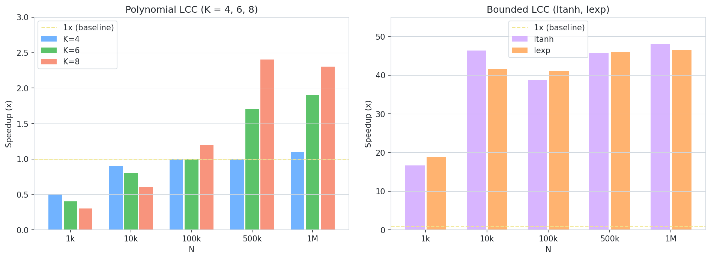

# gpuicalcc

GPU-accelerated locally centered cyclic contrasts for FastICA.

PyTorch extension of [icalcc](https://github.com/Kleinverse/icalcc). Same API, drop-in replacement with CUDA acceleration for polynomial and bounded LCC contrasts.

```python
from gpuicalcc import GPUICALCC
ica = GPUICALCC(n_components=4, K=6, device='cuda')
S_hat = ica.fit_transform(X)
```

## See Also

- [icalcc](https://github.com/Kleinverse/icalcc) — CPU version
- [Kleinverse Open Research Repository (KORR)](https://github.com/Kleinverse/research/tree/main/lcc) — research and experiment code

---

## Installation

```bash
pip install gpuicalcc
```

Requires PyTorch with CUDA. See [pytorch.org](https://pytorch.org) for installation instructions.

---

## Usage

```python
from gpuicalcc import GPUICALCC

# LCC order 6 on GPU
ica = GPUICALCC(n_components=4, K=6, device='cuda', random_state=0)
S_hat = ica.fit_transform(X)

# Bounded LCC-tanh with memory limit
ica = GPUICALCC(n_components=4, K='ltanh', device='cuda',
                batch_size=500, gpu_mem_limit=8, random_state=0)
S_hat = ica.fit_transform(X)

# Falls back to CPU automatically if CUDA unavailable
ica = GPUICALCC(n_components=4, K=8, device='cuda', random_state=0)
```

---

## Supported K Values

| K | Description |
|---|---|
| `4` | LCC polynomial order 4 |
| `6` | LCC polynomial order 6 (recommended) |
| `8` | LCC polynomial order 8 |
| `'fast4'` | FastICA(4), g(y) = y³ |
| `'fast6'` | FastICA(6), g(y) = y⁵ |
| `'fast8'` | FastICA(8), g(y) = y⁷ |
| `'tanh'` | logcosh contrast |
| `'exp'` | Gaussian contrast |
| `'ltanh'` | Locally centered tanh (GPU pairwise) |
| `'lexp'` | Locally centered exp (GPU pairwise) |
| `'skew'` | Skewness contrast (experimental) |

Polynomial LCC (K=4,6,8) and bounded LCC (K='ltanh','lexp') are GPU-accelerated. Classical contrasts ('tanh', 'exp', 'skew') and FastICA(k) fall back to the CPU implementation in `icalcc`.

---

## Parameters

| Parameter | Default | Description |
|---|---|---|
| `device` | `'cuda'` | PyTorch device. Falls back to `'cpu'` if CUDA unavailable |
| `batch_size` | `500` | Subsample size for bounded pairwise computation |
| `gpu_mem_limit` | `None` | GPU memory limit in GB. Auto-detected if None |
| `clear_gpu` | `True` | Clear GPU cache after fit |

---

## Benchmark

RTX 5080, `gpu_mem_limit=12GB`, single component extraction.



Polynomial contrasts (K=4,6,8) benefit from GPU at N≥500k. Bounded contrasts (ltanh, lexp) achieve 40–48x speedup across all sizes due to the O(N²) pairwise computation.

<details>
<summary>Raw numbers</summary>

| K | N | CPU (s) | GPU (s) | Speedup |
|---|---|---|---|---|
| 4 | 1k | 0.001 | 0.002 | 0.5x |
| 4 | 10k | 0.008 | 0.010 | 0.9x |
| 4 | 100k | 0.147 | 0.147 | 1.0x |
| 4 | 500k | 0.406 | 0.398 | 1.0x |
| 4 | 1M | 0.630 | 0.576 | 1.1x |
| 6 | 1k | 0.002 | 0.005 | 0.4x |
| 6 | 10k | 0.021 | 0.027 | 0.8x |
| 6 | 100k | 0.178 | 0.177 | 1.0x |
| 6 | 500k | 0.686 | 0.395 | 1.7x |
| 6 | 1M | 1.258 | 0.672 | 1.9x |
| 8 | 1k | 0.021 | 0.079 | 0.3x |
| 8 | 10k | 0.022 | 0.037 | 0.6x |
| 8 | 100k | 0.245 | 0.196 | 1.2x |
| 8 | 500k | 0.979 | 0.409 | 2.4x |
| 8 | 1M | 1.655 | 0.720 | 2.3x |
| ltanh | 1k | 0.101 | 0.006 | 16.7x |
| ltanh | 10k | 1.087 | 0.023 | 46.4x |
| ltanh | 100k | 12.328 | 0.318 | 38.7x |
| ltanh | 500k | 53.631 | 1.173 | 45.7x |
| ltanh | 1M | 104.210 | 2.168 | 48.1x |
| lexp | 1k | 0.108 | 0.006 | 18.9x |
| lexp | 10k | 1.210 | 0.029 | 41.6x |
| lexp | 100k | 15.443 | 0.376 | 41.1x |
| lexp | 500k | 67.916 | 1.477 | 46.0x |
| lexp | 1M | 130.470 | 2.807 | 46.5x |

</details>

---

## Requirements

- Python ≥ 3.9
- numpy ≥ 1.24
- scikit-learn ≥ 1.3
- icalcc ≥ 0.1.0
- torch ≥ 2.0

---

## Citation

```bibtex
@misc{saito2026lcc,
  author    = {Saito, Tetsuya},
  title     = {Locally Centered Cyclic Kernels for Higher-Order Independent Component Analysis},
  year      = {2026},
  publisher = {TechRxiv},
  doi       = {10.36227/techrxiv.XXXXXXX}
}
```

---

## License

[CC BY 4.0](https://creativecommons.org/licenses/by/4.0/)
